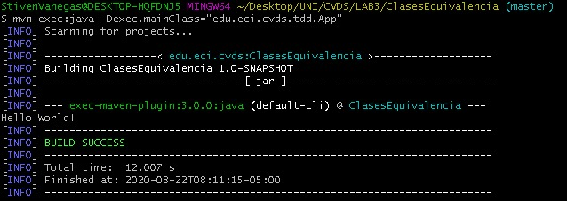
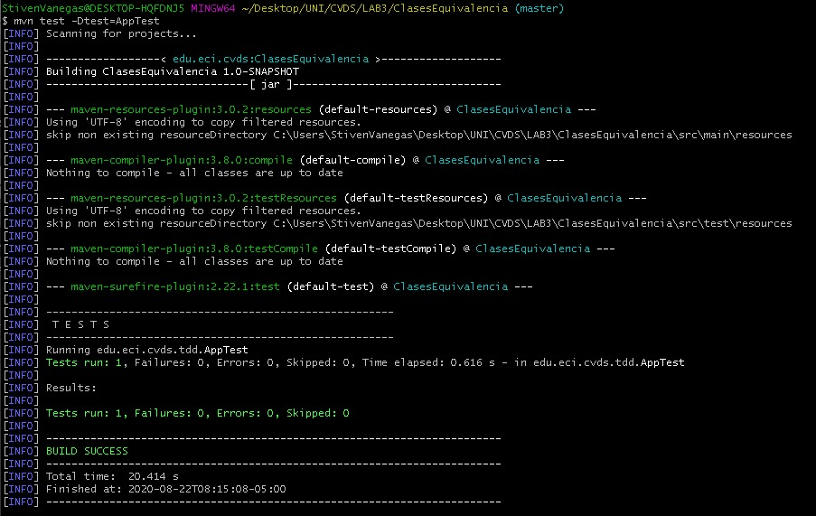
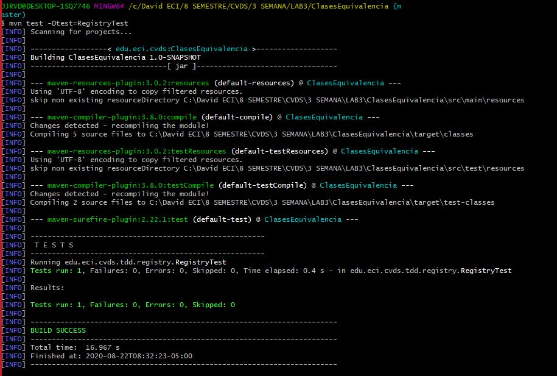

# LAB3

##Lab #3 - CVDS

### Datos básicos
 * **Nombres:** David Fernando Rivera\
				Janer Stiven Vanegas
				
**********************************************************
----------------------------------------------------------
**********************************************************
				
### Clases de Equivalencia
 * Consideramos que deberian de haber excepciones de parametros Invalidos cuando:
    * DEAD
		* Que la persona este viva.\ No puede pasar que:\ `DEAD != true`
	* UNDERAGE
	    * La persona tiene que ser acta para las elecciones.\ No puede pasar que `UNDERAGE<18`
	* INVALID_AGE
		* La persona tiene que tener una edad valida.\ No puede pasar que:\ `AGE<0 || AGE>122`
	* DUPLICATED
		* La persona tiene una cedula unica e intrasferible.\ No puede pasar que:\ `Haya mas de una persona con la misma cc`
	* VALID
	    * Todo lo anterior se tiene que cumplir.
	
				
### Compilar y Ejecutar
 * Ejecute los comandos necesarios de Maven, para compilar el proyecto y verificar que el proyecto se creó correctamente y los cambios realizados al archivo pom no generan inconvenientes.
 
 
 * Busque el comando requerido para ejecutar las pruebas unitarias de un proyecto desde Maven y ejecútelo sobre el proyecto. Se debe ejecutar la clase AppTest con resultado exitoso.
 
 
### Ejecutar las pruebas
 * Pruebas ejecutadas 
 
 
 
 
**********************************************************
----------------------------------------------------------
**********************************************************

## EJERCICIO DE EQUIVALENCIAS

 1. De acuerdo con lo indicado, y teniendo en cuenta que NO hay precondiciones, en qué casos se debería
	arrojar una excepción de tipo ExcepcionParametrosInvalidos?. Agregue esto a la especificación.
	
	* Consideramos que deberian de haber excepciones de parametros Invalidos cuando:
		* diasDeAntelacion<0
		* edad<0 
		* edad>122
		* tarifaBase<0
		
 2. En la siguiente tabla enumere un conjunto de clases de equivalencia que -según usted- creen una
	buena división del conjunto de datos de entrada de la función anterior:
	
	
