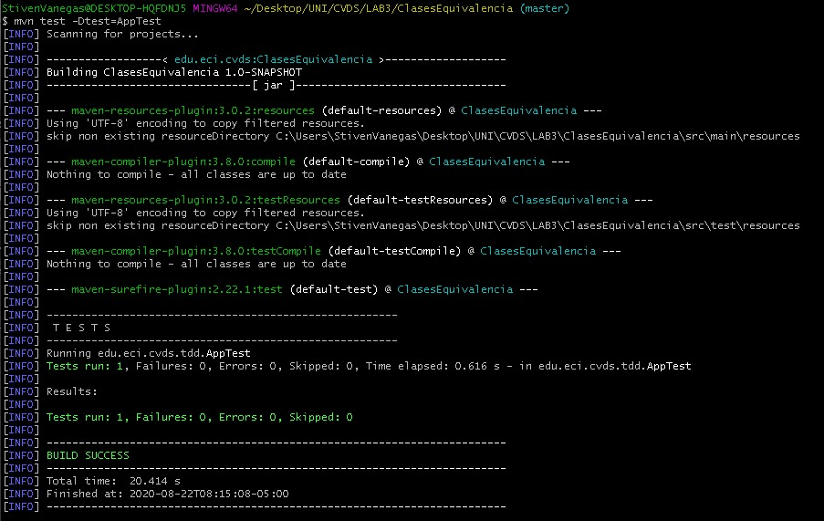
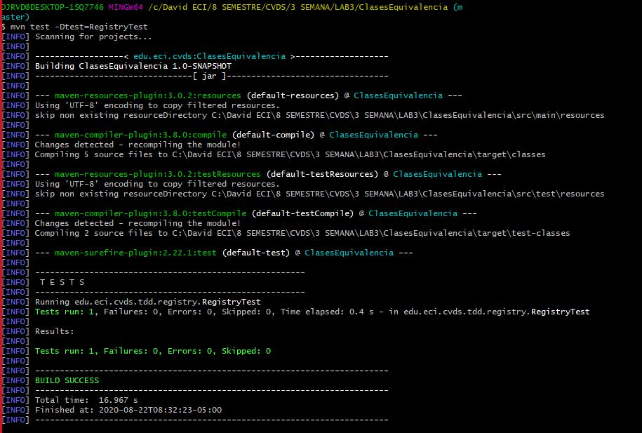

# LAB3

##Lab #3 - CVDS

### Datos básicos
 * **Nombres:** David Fernando Rivera\
				Janer Stiven Vanegas
				
**********************************************************
----------------------------------------------------------
**********************************************************
				
### Clases de Equivalencia
 * Consideramos que deberian de haber excepciones de parametros Invalidos cuando:
    * DEAD
		* Que la persona este viva.\ No puede pasar que:\ `DEAD != true`
	* UNDERAGE
	    * La persona tiene que ser acta para las elecciones.\ No puede pasar que `UNDERAGE<18`
	* INVALID_AGE
		* La persona tiene que tener una edad valida.\ No puede pasar que:\ `AGE<0 || AGE>122`
	* DUPLICATED
		* La persona tiene una cedula unica e intrasferible.\ No puede pasar que:\ `Haya mas de una persona con la misma cc`
	* VALID
	    * Todo lo anterior se tiene que cumplir.
	
				
### Compilar y Ejecutar
 * Ejecute los comandos necesarios de Maven, para compilar el proyecto y verificar que el proyecto se creó correctamente y los cambios realizados al archivo pom no generan inconvenientes.
 
 
 * Busque el comando requerido para ejecutar las pruebas unitarias de un proyecto desde Maven y ejecútelo sobre el proyecto. Se debe ejecutar la clase AppTest con resultado exitoso.
 
 
### Ejecutar las pruebas
 * Pruebas ejecutadas 
 
 
 
 
**********************************************************
----------------------------------------------------------
**********************************************************

## EJERCICIO DE EQUIVALENCIAS

 1. De acuerdo con lo indicado, y teniendo en cuenta que NO hay precondiciones, en qué casos se debería
	arrojar una excepción de tipo ExceptionParametrosInvalidos?. Agregue esto a la especificación.
	
	* Consideramos que deberian de haber excepciones de parametros Invalidos cuando:
		* `diasDeAntelacion<0`
		* `edad<0`
		* `edad>122`
		* `tarifaBase<0`
		
 2. En la siguiente tabla enumere un conjunto de clases de equivalencia que -según usted- creen una
	buena división del conjunto de datos de entrada de la función anterior:

	| Número | Clase de equivalencia (en lenguaje natural o matemático). | Resultado correcto/incorrecto. |
	| ------------- | ------------- | ------------- |
	| 1 | `tarifaBase < 0` | Incorrecto |
	| 2 | `edad<0` | Incorrecto |
	| 3 | `edad>122` | Incorrecto |
	| 4 | `diasAntelacion=<0` | Incorrecto |
	| 5 | `(0<=tarifaBase) && (20<diasAntelacion) && (65<edad)` | Correcto |
	| 6 | `(0<=tarifaBase) && (20<diasAntelacion) && (65>=edad) && (18<=edad)` | Correcto |
	| 7 | `(0<=tarifaBase) && (20<diasAntelacion) && (18>edad) && (0<edad)` | Correcto |
	| 8 | `(0<=tarifaBase) && (0<=diasAntelacion) && (20>=diasAntelacion) && (18>edad) && (0<edad)` | Correcto |
	| 9 | `(0<=tarifaBase) && (0<=diasAntelacion) && (20>=diasAntelacion) && (18<=edad) && (65>=edad)` | Correcto |
	| 10 | `(0<=tarifaBase) && (0<=diasAntelacion) && (20>=diasAntelacion) && (65<edad) && (122>edad)` | Correcto |

 3. Para cada clase de equivalencia, defina un caso de prueba específico, definiendo: parámetros de
    entrada y resultados esperados.
	
	| Número | Entradas | Salidas |
	| ------------- | ------------- | ------------- |
	| 1 | `tarifaBase=-1` | ExceptionParametrosInvalidos |
	| 2 | `diasAntelacion=-4` | ExceptionParametrosInvalidos |
	| 3 | `edad = -20` | ExceptionParametrosInvalidos |
	| 4 | `edad = 250` | ExceptionParametrosInvalidos |
	| 5 | `(tarifaBase=100)`, `(diasAntelacion=25)`, `(edad = 20)` | 77 |
	| 6 | `(tarifaBase=100)`, `(diasAntelacion=25)`, ` (edad=60) ` | 85 |
	| 7 | `(tarifaBase=100)`, `(diasAntelacion=30)`, `(edad=15)` | 80 |
	| 8 | `(tarifaBase=100)`, `(diasAntelacion=15)`, `(edad=80)` | 92 |
	| 9 | `(tarifaBase=100)`, `(diasAntelacion=15)`, `(edad=45)` | 100 |
	| 10 | `(tarifaBase=100)`, `(diasAntelacion=15)`, `(65<edad)` | 92 |

 4. A partir de las clases de equivalencia identificadas en el punto 2, identifique las condiciones límite o
    de frontera de las mismas.
	
	| Número | Fronteras | 
	| ------------- | ------------- | 
	| 1 | `tarifaBase<=0` | 
	| 2 | `diasAntelacion<0` |
	| 3 | `edad <= 0` |
	| 4 | `edad>122` | 
	| 5 | `(0>=tarifaBase) && (20>diasAntelacion) && (65<edad)` | 
	| 6 | `(0>=tarifaBase) && (20>diasAntelacion) && (65>=edad) && (18<=edad)` |
	| 7 | `(0<=tarifaBase) && (20<diasAntelacion) && (18>edad) && (0<edad)` |
	| 8 | `(0<=tarifaBase) && (0<=diasAntelacion) && (20>=diasAntelacion) && (18>edad) && (0<edad)` |
	| 9 | `(0<=tarifaBase) && (0<=diasAntelacion) && (20>=diasAntelacion) && (18<=edad) && (65>=edad)` |
	| 10 | `(0<=tarifaBase) && (0<=diasAntelacion) && (20>=diasAntelacion) && (122<edad)` |

 5. Para cada una de las condiciones de frontera anteriores, defina casos de prueba específicos.
 	
	| Número | Entradas | Salidas | 
	| ------------- | ------------- | ------------- | 
	| 1 | `tarifaBase=-2` | ExceptionParametrosInvalidos |
	| 2 | `diasAntelacion=-2` | ExceptionParametrosInvalidos |
	| 3 | `edad=0` | ExceptionParametrosInvalidos |
	| 4 | `edad=155` |  ExceptionParametrosInvalidos |
	| 5 | `(tarifaBase=0)`, `(diasAntelacion=25)`, `(edad=69)` | 0 | 
	| 6 | `(tarifaBase=0)`, `(diasAntelacion=25)`, `(edad=45)` | 0 |
	| 7 | `(tarifaBase=0)`, `(diasAntelacion=15)`, `(edad=155)` | ExceptionParametrosInvalidos |
